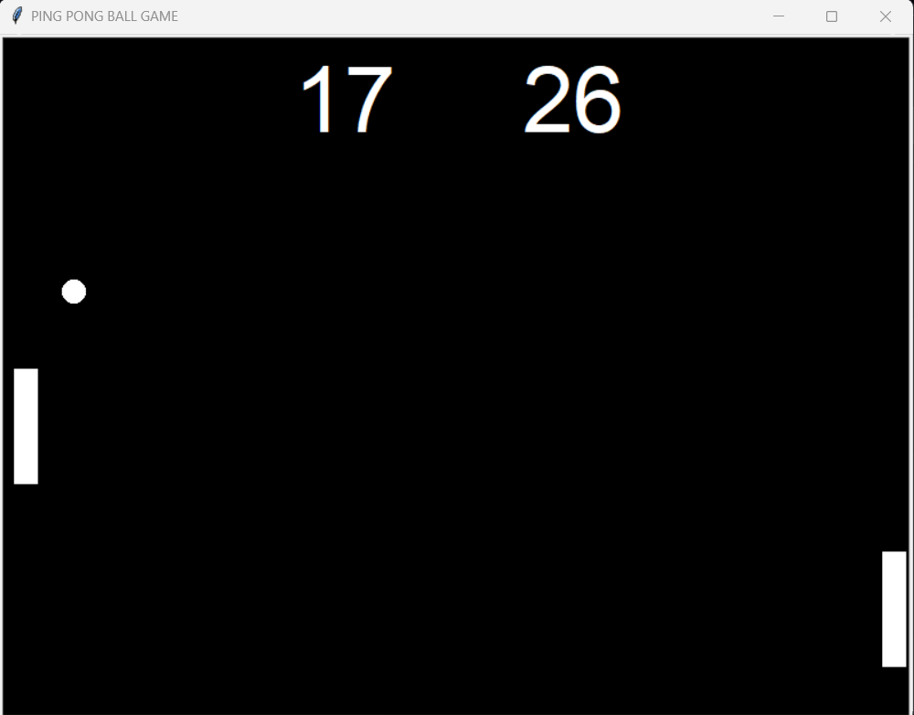

# Ping Pong

Ping Pong is a friendly little game where a ball bounces between 
the walls of the screen, and two paddles on opposite sides of the
screen need to resist the ball from touching their respective sides.

## How to run
1. Go to the destination folder on `Terminal`
2. Run command: `python3 main.py`

## How to play

### For Left Paddle:
`W` for moving upwards,
`S` for moving downwards

### For Right Paddle:
`↑` for moving upwards,
`↓` for moving downwards

## Rules:
* Whichever paddle makes the move to protect the ball from touching its respective wall gains a point.
* If the paddle is not able to resist the ball from touching its respective wall, the opponent paddle gains a point. 

### Here's a peek from the game

